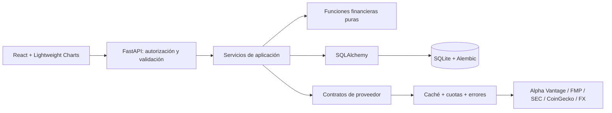

# Arquitectura propuesta

Monolito modular: React/TypeScript sirve una interfaz local y FastAPI expone `/api`. En desarrollo Vite redirige `/api` al backend; en Docker nginx hace lo mismo. El navegador conserva una cookie de sesión opaca y nunca recibe claves de proveedores.

## Límites de módulos

`api` transforma HTTP en comandos. `auth` valida sesiones, contraseñas y CSRF. `services` orquesta ORM y proveedores. `providers` traduce formatos externos a tipos internos. `analytics` no importa FastAPI, ORM ni HTTP. `portfolio` reconstruye posiciones cronológicamente. Las entidades personales se consultan con su propietario; un ID ajeno responde 404.

## Decisiones financieras

Un precio conserva moneda, fecha, fuente y base de ajuste. Un fundamental conserva concepto, unidad, inicio/fin del período, fecha de presentación, accession, descarga y fórmula cuando es derivado. Los valores incompletos son `null` acompañados de un motivo. Un total de cartera con precios o FX ausentes es incompleto, nunca una suma parcial presentada como total.

El PER histórico utiliza sólo información presentada antes de la fecha de valoración. Si únicamente existe una fecha de presentación sin hora, se admite desde el día siguiente. No mezclar precio ajustado por dividendos con EPS ni EPS de bases de acciones diferentes. Ver [[10 - Historical Valuation]].

## Evolución

PostgreSQL podrá sustituir SQLite mediante SQLAlchemy y migraciones. Los importes se serializan como cadenas decimales. Sin Redis, microservicios ni tareas cloud. Una futura cola de trabajos y límites compartidos serán necesarios antes de ejecutar varios workers.

## Ejecución

Sólo loopback en el host. El backend debe migrarse antes de arrancar. No realizar llamadas de mercado durante el arranque ni en los tests; la funcionalidad de cartera manual y autenticación funciona sin claves y sin conexión.
