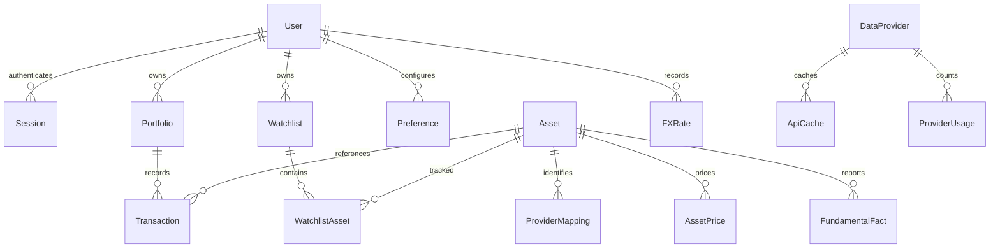

# Modelo inicial y ERD

## Tablas y restricciones previstas

| Entidad | Campos / unicidad | Observaciones |
|---|---|---|
| User | UUID, username único, email opcional, password_hash, active, role, created_at | Argon2id |
| Session | hash del token, user_id, csrf_token, expires_at | Token opaco aleatorio; revocable |
| Asset | UUID, symbol, exchange, currency, type, name, ISIN, sector, industry, country | Único por symbol/exchange/type; ticker no es identificador global |
| ProviderMapping | asset_id, provider, provider_symbol, provider_asset_id | Único por proveedor e identificador |
| AssetPrice | asset_id, date, provider, currency, OHLCV, adjustment, retrieved_at | Revisiones/upserts explícitos |
| FundamentalFact | asset_id, concept, unit, start/end, filed, accession, value, fiscal_period, retrieved_at | Se conservan revisiones; no sobrescribir historia conocida |
| Portfolio | UUID, user_id, name, description, base_currency, created_at | EUR por defecto |
| Transaction | UUID, portfolio_id, asset_id opcional, date, type, quantity, price, currency, fees, taxes, broker, notes, external_id | Orden estable date/created_at/id, importación deduplicada |
| Watchlist / WatchlistAsset | user_id / watchlist_id + asset_id, comment, tags, position, added_at | Propietario comprobado en todas las mutaciones |
| FXRate | user_id, base, quote, date, rate, source | Sin equivalencia implícita entre monedas diferentes |
| ApiCache | key hash, provider, payload, fetched_at, expires_at | Nunca incluye la API key en la clave o cuerpo persistido |
| ProviderUsage | provider, window/counters, retry_after, failures, last_success | Persistencia de cuotas |
| Preference | user_id + key, value | Sin secretos |

Company/CryptoAsset se representan mediante metadatos del activo; Dividend es una Transaction. PortfolioAsset, FinancialStatement y FinancialMetric son proyecciones, no tablas redundantes. Los grupos de peers y taxonomías históricas se introducen sólo con datos verificables.

## Tipos

UUID como cadenas portables; timestamps UTC, fechas financieras `date`; Decimal serializado sin pérdida en SQLite mediante tipo ORM de texto, Numeric en PostgreSQL. Las migraciones son explícitas, versionadas y reversibles. No usar create_all en producción.

Ver [[12 - Portfolio Engine]], [[10 - Historical Valuation]], [[29 - ADR Index]].
